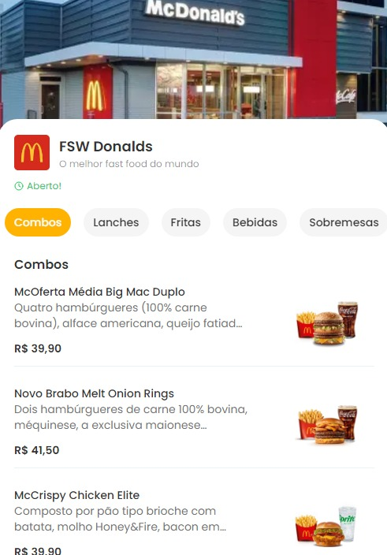
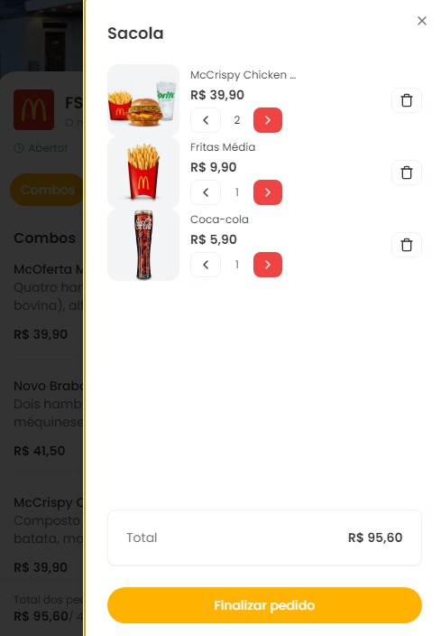

# 🍔 Sistema de Autoatendimento para Restaurantes 🍟

Este projeto é um sistema de autoatendimento para restaurantes, inspirado nos tótens encontrados no McDonald's e Burger King, feito para versões mobile para facilitar os pedidos. Com o uso de tecnologias modernas, busquei proporcionar uma experiência intuitiva e eficiente, permitindo que os clientes façam seus pedidos de maneira independente e prática. 📱🍽️

## 🌐 Acesso Online

Acesse o projeto diretamente na versão online:  
[https://mc-donalds-diogosns.vercel.app/didi-donalds](https://mc-donalds-diogosns.vercel.app/didi-donalds)

---

## 🚀 Tecnologias Utilizadas

- **Next.js** - Framework React para desenvolvimento do frontend ⚛️
- **TypeScript** - Tipagem estática para maior segurança e robustez no código 🔒
- **Figma** - Protótipos e design do sistema 🎨
- **Prisma** - ORM para facilitar o gerenciamento do banco de dados 💾
- **NeonDB** - Banco de dados PostgreSQL em nuvem ☁️
- **PostgreSQL** - Banco de dados relacional para armazenamento seguro 🔐
- **Tailwind CSS** - Estilização moderna e responsiva para um design clean 💅

## 🔍 Visão Geral do Sistema

### 🏠 Página Inicial


  


Tela inicial do restaurante, onde o usuário pode iniciar o processo de pedido. 

---

### 🍕 Catálogo de Produtos


  


Listagem dos itens disponíveis no restaurante, organizados por categoria para facilitar a navegação.

---

### 🛒 Itens Selecionados


  


Tela que exibe os itens escolhidos pelo cliente antes de concluir o pedido.

---

### 🧾 Carrinho do Cliente


  


Resumo do pedido, permitindo que o cliente revise e finalize a compra.

---

## ⚙️ Instalação e Uso

### 🏃‍♂️ Como rodar o projeto

1. Instale as dependências:  
   ```sh
   npm install
2. Configure o banco de dados no arquivo:  
   ```sh
   .env

3. Inicie o servidor de desenvolvimento:
   ```sh
   npm run dev
   
5. Acesse o projeto no navegador:
    ```sh  
   http://localhost:3000

